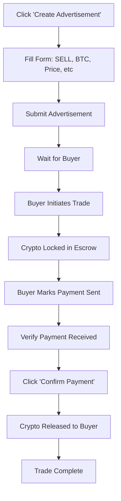
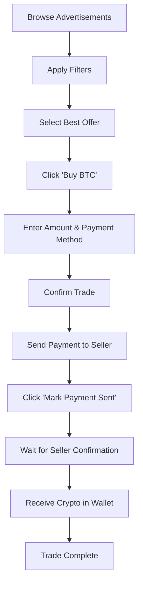

# 🤝 P2P Marketplace - Complete Guide

## 📋 Table of Contents

1. [What is P2P Trading?](#what-is-p2p-trading)
2. [How It Works](#how-it-works)
3. [Key Features](#key-features)
4. [User Journey](#user-journey)
5. [Technical Implementation](#technical-implementation)
6. [Security & Safety](#security--safety)
7. [Best Practices](#best-practices)

---

## 🎯 What is P2P Trading?

**Peer-to-Peer (P2P) Trading** is a decentralized marketplace where users can buy and sell cryptocurrencies **directly with each other** without relying on traditional exchange order books or market makers.

### The Purpose

P2P trading solves several key problems in cryptocurrency trading:

1. **Price Flexibility**: Users set their own prices based on personal preferences and market conditions
2. **Payment Options**: Support for diverse payment methods (bank transfers, PayPal, cash, etc.)
3. **Accessibility**: Trade in regions with limited banking infrastructure
4. **Privacy**: Minimal personal information disclosure
5. **Lower Fees**: Direct trading eliminates intermediary costs

### Why Use P2P Instead of Traditional Exchange?

| Traditional Exchange    | P2P Marketplace              |
| ----------------------- | ---------------------------- |
| Fixed market price      | Negotiable pricing           |
| Limited payment methods | Multiple payment options     |
| Instant execution       | Requires seller confirmation |
| High liquidity          | Variable liquidity           |
| Exchange controls funds | Escrow-based protection      |
| Centralized             | Decentralized interactions   |

---

## ⚙️ How It Works

### The 4-Step Process

```
┌─────────────────┐
│  1. CREATE AD   │  User posts buy/sell advertisement
└────────┬────────┘
         │
         ▼
┌─────────────────┐
│ 2. MATCH TRADE  │  Another user finds and accepts the offer
└────────┬────────┘
         │
         ▼
┌─────────────────┐
│ 3. ESCROW LOCK  │  Crypto is locked in secure escrow
└────────┬────────┘
         │
         ▼
┌─────────────────┐
│ 4. PAYMENT &    │  Buyer pays → Seller confirms → Release
│    RELEASE      │
└─────────────────┘
```

### Detailed Workflow

#### Step 1: Create Advertisement

A user (maker) creates an advertisement specifying:

- **Type**: BUY or SELL
- **Currency**: BTC, ETH, etc.
- **Price**: Rate per unit in fiat currency
- **Amount**: Available cryptocurrency quantity
- **Limits**: Min/max transaction amounts
- **Payment Methods**: Accepted payment options
- **Time Limit**: Deadline for payment completion
- **Terms**: Custom conditions and requirements

#### Step 2: Initiate Trade

Another user (taker) browses advertisements and:

- Filters by currency, price, payment method
- Selects an advertisement
- Specifies the amount they want to trade
- Chooses a payment method
- Initiates the trade

#### Step 3: Escrow Protection

When a trade is initiated:

- If SELL order: Seller's crypto is **automatically locked in escrow**
- Trade status becomes "PENDING"
- Payment timer starts counting down
- Both parties can view trade details

#### Step 4: Payment & Completion

The final phase involves:

- **Buyer**: Sends payment via chosen method → Marks "Payment Sent"
- **Seller**: Receives payment → Verifies amount → Clicks "Confirm Payment"
- **System**: Automatically releases crypto from escrow to buyer
- **Status**: Trade marked as "COMPLETED"

---

## ✨ Key Features

### 1. **Advanced Filtering System**

- Filter by ad type (Buy/Sell)
- Filter by cryptocurrency
- Filter by payment method
- Real-time search functionality
- Dynamic advertisement count

### 2. **Escrow Protection**

- Automatic fund locking
- Secure holding mechanism
- Prevents fraud and scams
- Automatic release on confirmation
- Dispute resolution support

### 3. **Multiple Payment Methods**

- Bank Transfer
- PayPal
- Cash (in-person)
- Venmo
- Zelle
- Easily extensible

### 4. **Responsive Design**

- Mobile-friendly interface
- Touch-optimized controls
- Adaptive layouts
- Smooth animations
- Modern UI/UX

### 5. **Trade Management**

- View all active trades
- Track trade status
- Action buttons based on role
- Real-time updates
- Trade history

### 6. **User Safety**

- Payment time limits
- Escrow protection
- Clear status indicators
- Confirmation dialogs
- Terms & conditions support

---

## 👤 User Journey

### As a Seller (Offering Crypto)



**Seller Experience:**

1. Posts advertisement with desired price and payment methods
2. Cryptocurrency is ready in wallet
3. Receives notification when buyer initiates trade
4. Crypto automatically moves to escrow
5. Receives payment via chosen method
6. Confirms payment receipt
7. System releases crypto to buyer

### As a Buyer (Purchasing Crypto)



**Buyer Experience:**

1. Browses available sell advertisements
2. Filters by preferred currency and payment method
3. Reviews price, limits, and terms
4. Initiates trade with desired amount
5. Sends payment using agreed method
6. Marks payment as sent in system
7. Waits for seller confirmation
8. Receives crypto in wallet

---

## 🔧 Technical Implementation

### Frontend Architecture

**Component Structure:**

```
P2pComponent
├── Hero Section (Info + Create Button)
├── Filter Bar (Type, Currency, Payment, Search)
├── Advertisements Grid
│   └── Ad Cards (Price, Limits, Payment Methods)
├── Trade Modal (Initiate Trade Form)
├── Info Modal (How P2P Works)
└── My Trades Table (Active Trades Management)
```

**Key Technologies:**

- **Angular 18**: Component framework
- **RxJS**: Reactive state management
- **SCSS**: Advanced styling with animations
- **Standalone Components**: Modern Angular architecture
- **Reactive Forms**: Form validation and handling

### Backend Integration

**API Endpoints:**

```typescript
GET  /p2p/advertisements          // List all active ads
POST /p2p/advertisements          // Create new ad
GET  /p2p/my-advertisements       // User's own ads
POST /p2p/trades                  // Initiate trade
GET  /p2p/my-trades              // User's trades
POST /p2p/trades/:id/payment-sent // Mark payment sent
POST /p2p/trades/:id/confirm-payment // Confirm & release
POST /p2p/trades/:id/cancel      // Cancel trade
```

**Data Models:**

```typescript
P2PAdvertisement {
  id: number
  ad_type: 'BUY' | 'SELL'
  currency: string
  fiat_currency: string
  price: string
  min_limit: string
  max_limit: string
  available_amount: string
  payment_methods: string[]
  payment_time_limit: number
  terms_conditions?: string
  is_active: boolean
}

P2PTrade {
  id: number
  advertisement_id: number
  buyer_id: number
  seller_id: number
  amount: string
  price: string
  total_fiat: string
  currency: string
  fiat_currency: string
  payment_method: string
  status: 'PENDING' | 'PAYMENT_SENT' | 'COMPLETED' | 'CANCELLED'
  payment_deadline: string
}
```

### State Management

**Service Layer:**

```typescript
P2pService
├── advertisements$ (BehaviorSubject)
├── trades$ (BehaviorSubject)
├── createAdvertisement()
├── getAdvertisements()
├── initiateTrade()
├── markPaymentSent()
├── confirmPayment()
└── cancelTrade()
```

**Component State:**

- Filtered advertisements (local filtering)
- Filter values (type, currency, payment)
- Search term
- Loading states
- Modal visibility
- Selected advertisement
- Success/error messages

---

## 🔒 Security & Safety

### Escrow System

**How Escrow Works:**

1. **Lock**: Seller's crypto locked when trade initiated
2. **Hold**: Funds held securely by smart contract/backend
3. **Verify**: Seller confirms payment receipt
4. **Release**: Automatic transfer to buyer on confirmation

**Benefits:**

- Prevents seller from backing out
- Protects buyer from scams
- Automated execution
- Transparent process
- Dispute resolution support

### Safety Mechanisms

1. **Payment Time Limits**

   - Enforces timely payment
   - Auto-cancellation on timeout
   - Prevents indefinite holds

2. **Confirmation Requirements**

   - Seller must verify payment
   - Buyer must mark payment sent
   - Double confirmation process

3. **Transaction Limits**

   - Minimum trade amounts
   - Maximum trade amounts
   - Prevents micro/macro abuse

4. **User Reputation** (Coming Soon)
   - Trade completion rate
   - User ratings
   - Response time tracking

### Dispute Resolution

**When Disputes Occur:**

- Buyer claims payment sent but seller denies
- Payment sent but not received
- Wrong amount transferred
- Quality/service issues

**Resolution Process:**

1. User opens dispute
2. Provides evidence (screenshots, transaction IDs)
3. Admin reviews case
4. Decision: Release to buyer OR Return to seller
5. Update reputation scores

---

## 📝 Best Practices

### For Sellers

✅ **Do:**

- Set competitive prices based on market rates
- Offer multiple payment methods
- Respond quickly to trade requests
- Verify payments thoroughly before confirming
- Keep adequate crypto balance in wallet
- Write clear terms and conditions
- Be professional and courteous

❌ **Don't:**

- Set unrealistic prices
- Confirm payment without verification
- Delay response beyond reasonable time
- Create duplicate advertisements
- Request payment outside the platform

### For Buyers

✅ **Do:**

- Read terms and conditions carefully
- Send exact payment amount
- Include reference/note if required
- Mark payment sent immediately after transfer
- Keep payment proof (screenshots, receipts)
- Respect payment deadlines
- Communicate clearly with seller

❌ **Don't:**

- Send partial payments
- Use different payment method than agreed
- Delay payment without communication
- Mark payment sent before actually sending
- Dispute valid transactions

### General Guidelines

1. **Start Small**: Begin with smaller amounts to build trust
2. **Check Reputation**: Look for users with good track records
3. **Read Everything**: Don't skip terms and conditions
4. **Save Evidence**: Keep all transaction proofs
5. **Be Patient**: Some payment methods take time
6. **Communicate**: Keep seller/buyer informed
7. **Stay On Platform**: Don't take conversations off-platform

---

## 🎨 UI/UX Improvements

### Design Enhancements

1. **Hero Section**

   - Eye-catching gradient title
   - Clear value proposition
   - "How It Works" button for education
   - Prominent CTA for creating ads

2. **Advanced Filtering**

   - Multiple filter options
   - Real-time search
   - Active filter count
   - Clear filter states

3. **Advertisement Cards**

   - Large, prominent price display
   - Visual indicators for buy/sell
   - Icon-based information rows
   - Hover effects and animations
   - Gradient accents

4. **Modal Design**

   - Smooth animations
   - Clear information hierarchy
   - SVG icons throughout
   - Real-time total calculation
   - Input validation hints

5. **Responsive Layout**
   - Mobile-first approach
   - Touch-friendly controls
   - Adaptive grid layouts
   - Optimized for all screen sizes

### Interactive Elements

- **Hover Effects**: Cards lift and highlight on hover
- **Color Coding**: Buy (green), Sell (red), Neutral (yellow)
- **Loading States**: Clear feedback during actions
- **Success/Error Alerts**: Prominent notifications with icons
- **Smooth Transitions**: All state changes animated
- **Focus States**: Accessible keyboard navigation

---

## 🚀 Future Enhancements

### Planned Features

1. **Chat System**

   - In-trade messaging
   - File attachments
   - Read receipts
   - Notification system

2. **Reputation System**

   - Star ratings
   - Verified badges
   - Trade completion percentage
   - Response time metrics

3. **Advanced Filters**

   - Sort by price, reputation, speed
   - Distance-based (for cash trades)
   - Preferred sellers list
   - Recent traders

4. **Recurring Trades**

   - Favorite advertisements
   - Auto-trade settings
   - Price alerts
   - Quick repeat trades

5. **Analytics Dashboard**

   - Trade history graphs
   - Profit/loss tracking
   - Popular payment methods
   - Peak trading times

6. **Multi-Currency Support**
   - More cryptocurrencies
   - More fiat currencies
   - Currency conversion rates
   - Multi-currency wallets

---

## 📊 Statistics & Metrics

### Key Performance Indicators

- **Average Trade Time**: Time from initiation to completion
- **Success Rate**: Percentage of completed trades
- **Dispute Rate**: Percentage of trades with disputes
- **User Retention**: Returning users percentage
- **Payment Method Distribution**: Most popular methods
- **Average Trade Size**: Typical transaction amounts

### Business Benefits

1. **Revenue Streams**

   - Small fee per completed trade
   - Premium advertisement placement
   - Featured seller badges
   - Express dispute resolution

2. **User Growth**

   - Network effects (more users = more liquidity)
   - Referral programs
   - Competitive pricing attracts users
   - Multiple payment options expand market

3. **Market Differentiation**
   - Flexibility vs traditional exchanges
   - Privacy-focused approach
   - Community-driven platform
   - Local payment method support

---

## 🎓 Conclusion

The P2P Marketplace provides a **flexible, secure, and user-friendly platform** for direct cryptocurrency trading. By combining modern UI/UX design with robust security mechanisms, it offers users:

- **Freedom**: Set your own prices and terms
- **Safety**: Escrow protection and dispute resolution
- **Convenience**: Multiple payment methods and filters
- **Transparency**: Clear status tracking and trade history

Whether you're a buyer looking for the best rates or a seller wanting to earn from your crypto holdings, the P2P marketplace creates a **win-win environment** for all participants.

---

## 📞 Support & Resources

- **User Guide**: Complete walkthrough of features
- **FAQ**: Common questions and answers
- **Security Tips**: Best practices for safe trading
- **Dispute Process**: How to handle issues
- **Contact Support**: Get help when needed

---

**Built with ❤️ using Angular, designed for traders by traders.**
